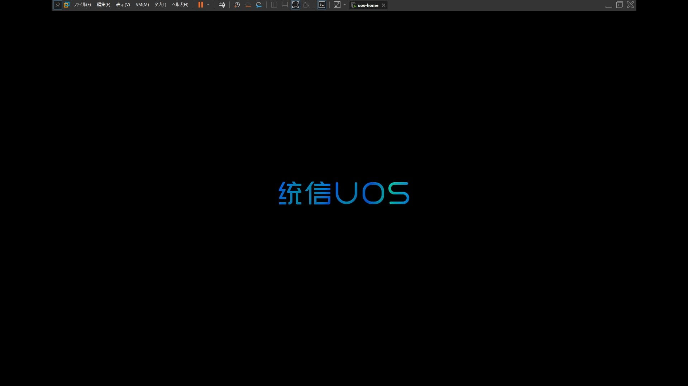
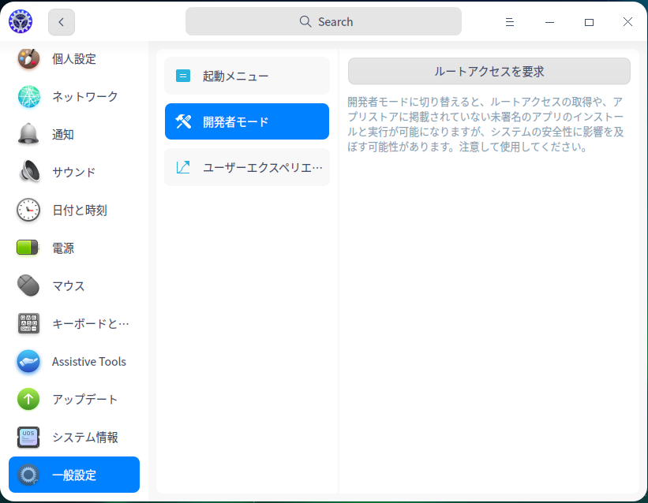

現在中国で開発されているDebian（Deepin）ベースのOS、UOSというものがあります。  
この記事では、公式が配布しているHome版とProfessional版を試してみます。

## 諸注意

この記事に書いてある内容を試すときに、Union IDが必要だったりします。  
「もう中国に情報ほとんど提供したから大丈夫やろ！」  
「個人情報？どうでもいいや」  
といった人は126でメアド登録してどんどん試しましょう。

## Uniontechとは

> 统信软件是以“打造中国操作系统创新生态”为使命的中国基础软件公司，由国内领先的操作系统厂家于2019年联合成立。
>
> 公司介绍 – 统信软件

2019年に中国内のOS開発企業が共同で設立した会社です。Wikipediaでは、「中国から委託されてOSを作っている」と書いてあります。

## UOSとは

Uniontechが開発しているOSです。中国内のWindowsを置き換えるOSを目指しているらしい。  
UIはDDEなのでDeepinと全く同じように見えますが、中身が少し増えていたりします。

## ダウンロード

### Home版（桌面个人版）

https://www.chinauos.com/

公式サイトで**注册**からアカウントを登録します。

次に、**资源中心**から**桌面个人版**をダウンロードします。
（ダウンロード元がいくつか選べますが、ここでは**官方下载**を選択することをおすすめします）

### Professional版（桌面专业版）

Home版とは別にProfessional版というものがあり、こちらは主に企業向けに提供しているようです。  
アンチウイルスや多くのCPUアーキテクチャのサポートなど、Home版よりも強化されています。

~~Professional版も公式からダウンロードすることはできますが、問題は「Pro版を使うための確認をするぞ！個人用途だったらHome版を使え！」って言われることです。~~
~~とりあえず私のGoogleドライブにミラーを上げておいたので、そこからダウンロードできます。~~
~~（実際に使うためにはライセンスが必要です。）~~

~~Baidu Pan（百度网盘）のリンクがたまたまあったのでそこからダウンロードできました。~~
~~ただ、Baidu Panは無料で使える速度がおおよそ120KB/sぐらいなので、ダウンロードするのに5時間ぐらいかかりました。~~

（2023/01/29）
いつのまにか確認がいらなくなっていました。謎です。

https://drive.google.com/file/d/1XcL6ZedgJafPmtO0pALkk64iAQzWhxHp/view?usp=sharing

## インストール

インストールのためには、インストール先の環境に64GBの空き容量が必要です。

まずは起動させます。

## スクリーンショット

## Rootを取る

Rootを取るためには、UnionIDが必要です。

1. 「コントロールセンター」→「UnionID」

2. プライバシーポリシーに同意し、ログイン。

3. もう一つポリシーがあるので同意する。
4. 「一般設定」→「開発者モード」→「ルートアクセスを要求」

5. オンラインを選択し、次へ
6. 「同意してルートアクセスを要求」にチェックを入れ、Confirm
7. 再起動で完了

## 感想

DDEを使っている環境はどれも綺麗でいいのですが、UOSはDDEをさらにカスタムしてあって、より綺麗に見えますね。  
ちょっとカスタマイズすれば日本語でも使いやすい環境になると思うので、試しに実機に入れてみても面白いかもしれません。
