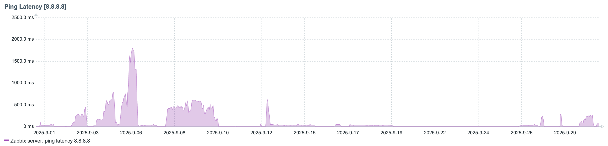

自宅の回線をNURO光G2VからBIGLOBE光10ギガに変更した。

それに伴って10G対応ルーターに変更しようということになり、同時購入キャンペーンのあるBUFFALO WXR9300BE6Pを導入。

したはいいものの、しょっちゅう接続が切れるわ、パケットはロスするわ、ろくな事はない。

## TL;DR

BIGLOBE光10ギガの契約時に同時購入でルーターを買うときは、BUFFALO以外のものを選ぶべき。

## 問題点

### ONUと接続が切れる (自己解決)

定期的にONUとの接続が切れる。

これはルーターとONU間のケーブルにCat.7ケーブルを使っていたのが原因っぽい。

### ping値がおかしい (一時的な解決)

起動後数時間〜数日経つと、急に無線LANのping値が跳ね上がる(だいたい100ms ~ 2000ms)。有線LANは普通。

これについては原因がわからず、詳細設定 > Wi-Fi設定 > 6 GHzからチャンネルを別のものに変えてWi-Fiを再起動することで一時的に解決させていた。

Wi-Fiを再起動するとしばらくはping値が10ms以下で安定するが、同様に数時間〜数日経つと再発する。

> [!NOTE]
> いつどの程度ping値が上がるのかを確かめるため、放置されていたラズパイにzabbixを導入した。
> グラフとして可視化されてかなりわかりやすくなった。
> 

## 最終的に

ルーターの設定をいじくり回すのを諦め、TP-LinkのBE7200を購入。

半年に渡る長い戦いが幕を閉じた。（なお、こちらの負け）
