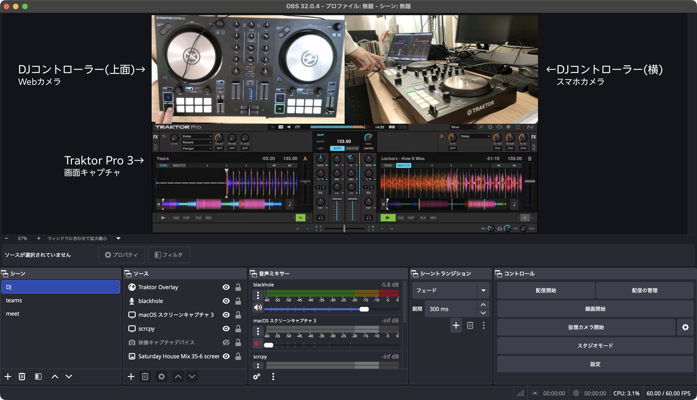
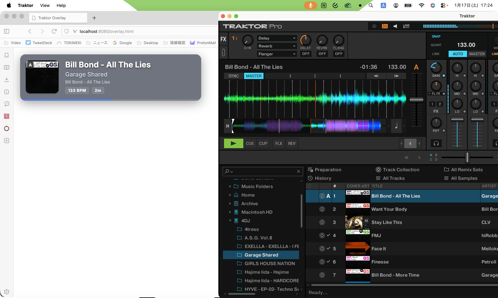

最近、Native InstrumentsのTraktor Kontrol S2 MK3を購入しました。


結構楽しいです。

## DJ配信する

せっかくなのでDJをしている様子を配信したいわけです。

というわけで、とりあえずこんな感じでレイアウトを組みました。


やってる最中の画面が撮れなかったので画像で置いてますが、要はこういうことです。



### 手元カメラ

Webカメラで撮っています。暫定的にデスクライトに吊り下げてますが、本当はAmazonで3000円前後の手元撮影用カメラスタンドが売っているので、そっちにした方が良い。


### 横カメラ

スマホのカメラを使っています。みんな大好き[scrcpy](https://github.com/Genymobile/scrcpy)でカメラ映像を取ってきていますが、時々フレームドロップが発生してWebカメラの映像とズレるので、コマンドを見直したほうが良いかもしれない。

今はこれで撮っています。

```sh
scrcpy -d --video-source=camera --camera-facing=back --camera-size=1920x1080 --no-audio
```

### Traktor Pro 3

OBSのウィンドウキャプチャで撮っています。

## マスター音声を載せる

普通にTraktor Pro 3の画面キャプチャからの音を配信に載せると、ヘッドホン出力(CUEとか)がそのまま載ってしまいます。

ここらへんの話は公式サポートに書いてあるのでそこを見たほうが早いかもしれません。

https://support.native-instruments.com/hc/ja/articles/360006980357

残念ながら私はオーディオインターフェースを所持していないので、ループバックを使ってマスターを取り出します。(この記事で言うところの"セットアップC")

この記事ではSoundflowerが推奨されてますが、Apple Silliconデバイスには対応してないので[BlackHole](https://github.com/ExistentialAudio/BlackHole)を使います。インストールしたら、セットアップCの`Soundflower（2ch）`を`BlackHole（2ch）`に読み替えて進めていけばループバックが出来ます。

## オーバーレイを作る

https://github.com/opera7133/traktor-overlay

今流している楽曲の情報を画面に表示したいので、OBS用にオーバーレイを作ります。

[unbox](https://github.com/erikrichardlarson/unbox)や[What's Now Playing](https://github.com/whatsnowplaying/whats-now-playing)のような良さげなツールもあったのですが、手元で動きませんでした。

### データ取得

Traktor Pro 3からデータを受け取る方法としては、Icecastで受け取るか、Controllerから受け取るかの2種類があります。(自分の知る範囲で)

Icecastはまだ良くわかっていないので、実装が楽なController経由で作っていきます。

この方法はTraktor Kontrol D2に渡されるはずのデータをjson形式で別のAPIサーバーに送るというもので、GitHubに実装が転がってました。

https://github.com/ErikMinekus/traktor-api-client

### データ表示

expressでWebサーバーとWebsocketサーバーを立てることにします。

Webサーバーはオーバーレイの表示とTraktorのデータ取得、Websocketサーバーはオーバーレイに取得したデータを送るために使います。

詳細なコードは先程の`traktor-overlay`リポジトリの`src/server.ts`や`src/template/script.js`を見てもらったほうが早いです。

`server.ts`はTraktorのデータを待ち構えて型にはめ、Websocketに乗せてbroadcastしています。`script.js`はデータを受け取ってtemplateにデータを入れていきます。

### 完成形

楽曲がデッキにロードされると情報が表示されます。再生時間はそれぞれのカードの下にプログレスバー形式で表示されます。

2つ楽曲がロードされている状態では横並びになり、再生位置が後ろの方の楽曲が左に出ます。



## まとめ

DJ楽しいです。

https://youtube.com/live/-9jF5L4X66A
