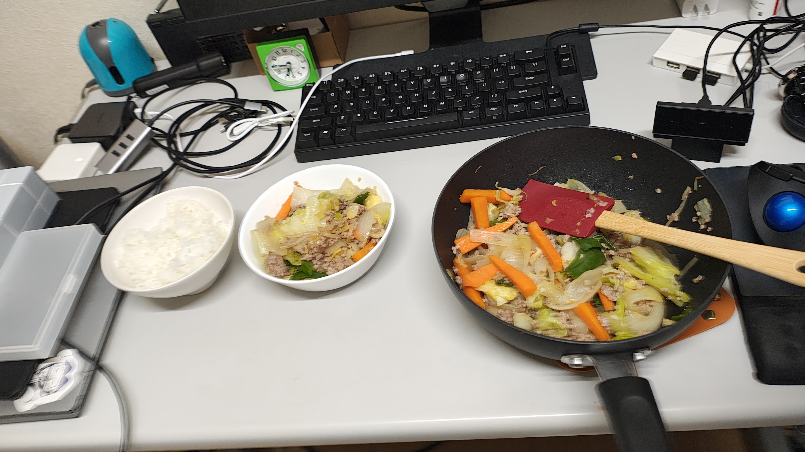
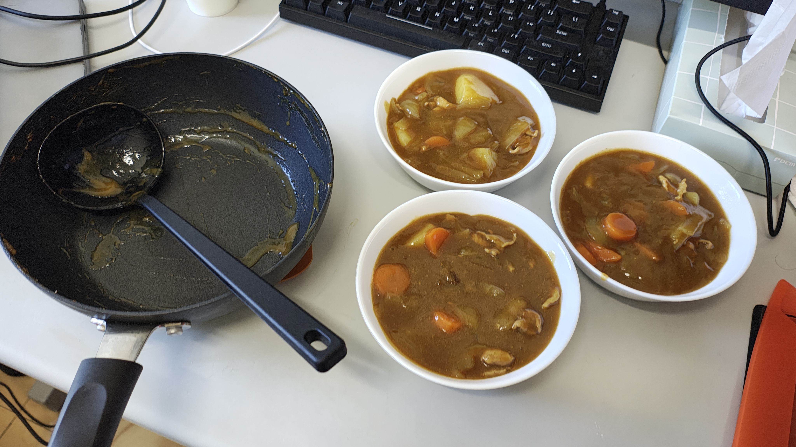
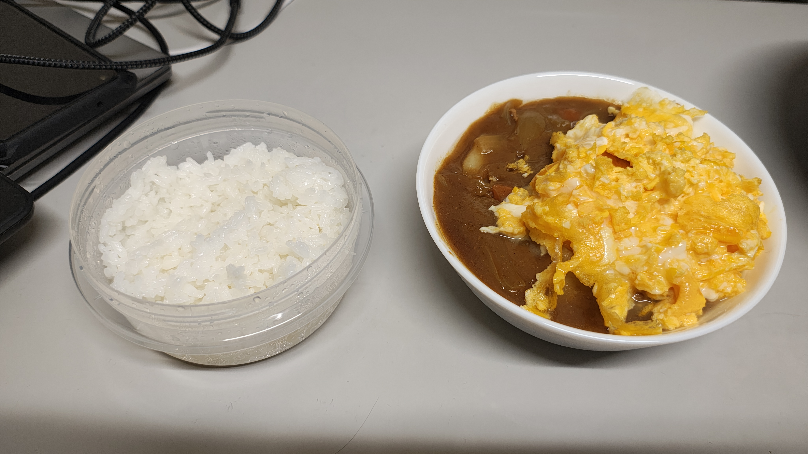
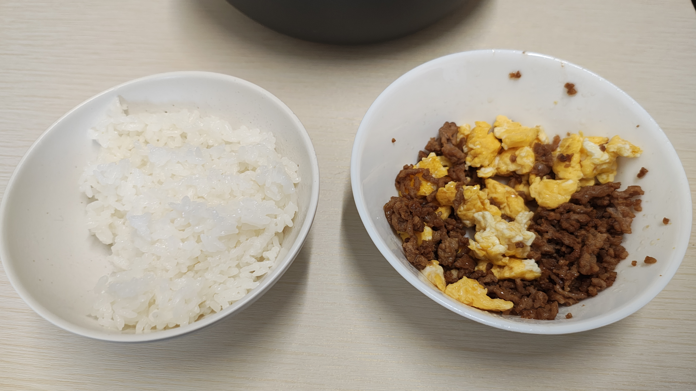
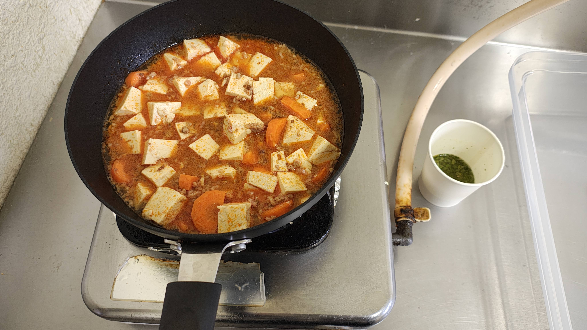
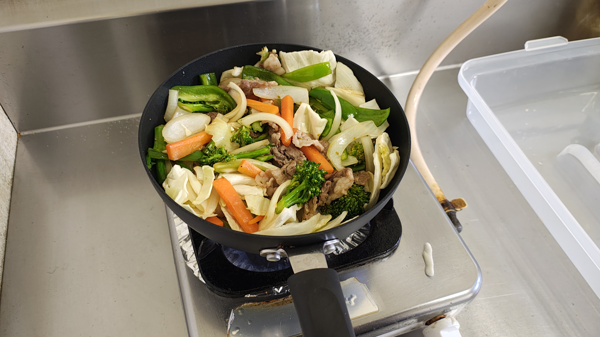
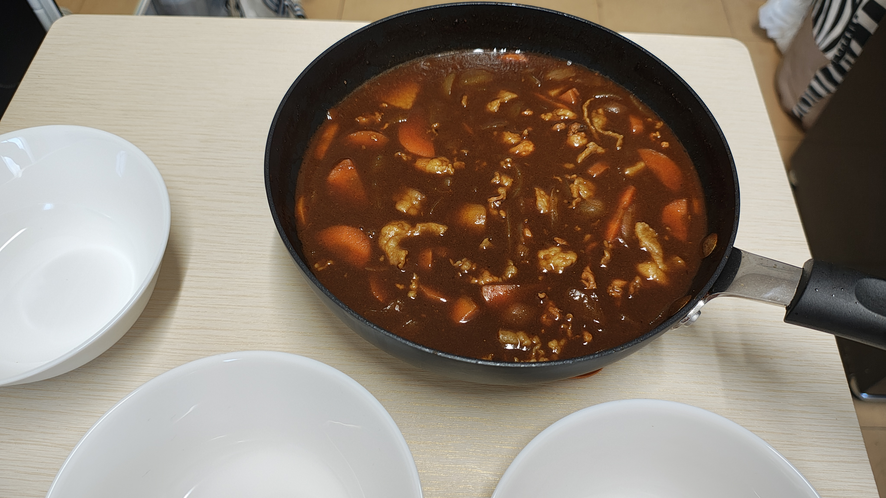
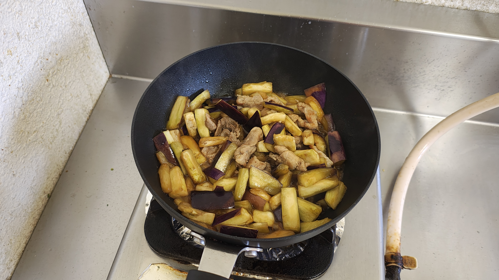
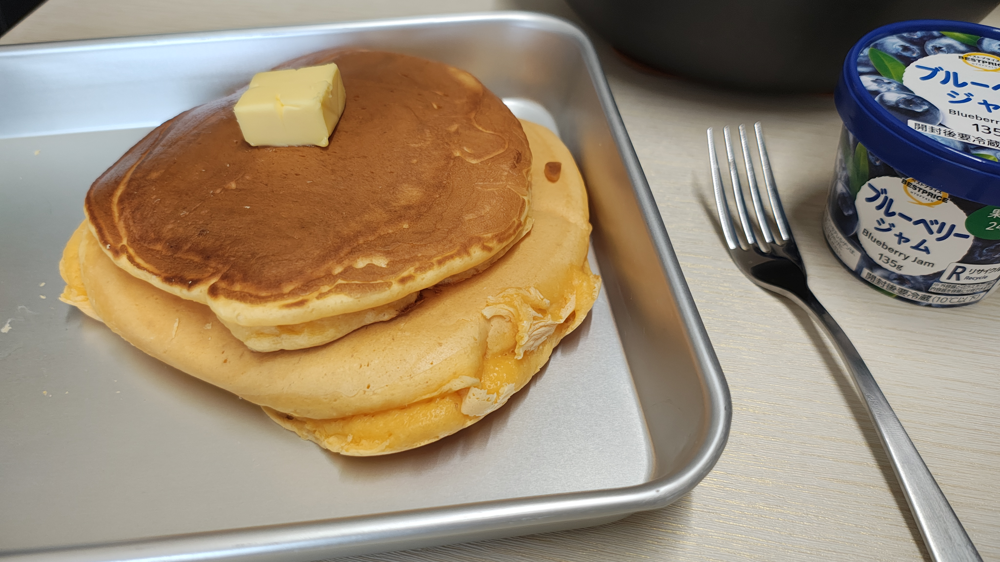
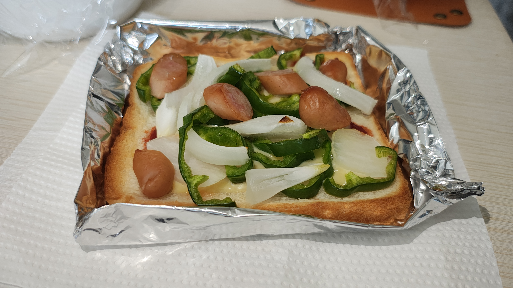

## 4月

道の駅でキャベツを買ってしまったため、さっさと使わないといたんでしまう。
どうにか大量の野菜炒めを作って消費していた。

初カレー。ベストプライスのカレールーを使ったが、意外とうまい。

親に卵を摂取したほうが良いと言われたので、イオンで10個パックを買ったがまったく消費していなかった。
期限が間近でまずいので、取り急ぎスクランブルエッグにしてオムカレーにした。

肉卵そぼろ。シンプルでおいしい。

麻婆豆腐。素と豆腐と挽肉だけで作れて、楽。作り置きにもできる。

野菜炒め。友達から余ったブロッコリーをもらったので使ってみた。

## 5月

5月中は親からカレールー1kgが送られてきたのもあり、夜ごはんはほとんどカレーだった。
このカレールーは実家でカレーを作っていたときからお気に入りのもの。（テーオー食品 ハイグレード21カレールウ）

なすと豚肉の炒め物。道の駅ではいたんでいたり、見た目の悪いなすが安く売られているのだが、中々使う機会がなく。
そろそろまずいかと思ったので、大量のなすを使って炒め物。

ホットケーキ。イオンお買い物アプリでホットケーキミックスが安かったので、作ってみた。
お菓子はどんどん作っていきたい。

## 6月

トースターを購入。ピザトーストを作る材料を買ってきて作ってみた。
パンが食えるのは良い。
