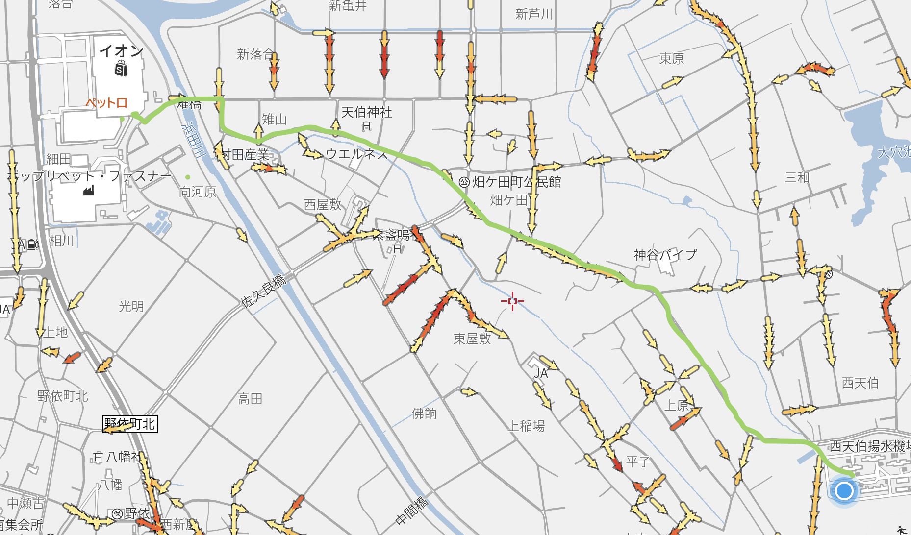

お金のない家庭や学生にとって、豊橋技科大の学生宿舎はかなり手頃な物件です。

安かろう悪かろうじゃないかって？それはそう。

## 引越しの手順

業者に依頼する場合は、指定の業者で手続きがあると思うので、その通りに進めます。

自分や家族で引っ越しをする場合は、車やトラックに荷物をつんで、技科大まで持っていきます。

どこの駐車場に停めても良いですが、学生宿舎から一番近いのは北駐車場です。

でもそれでも遠いので、住む棟の裏手の道路に一時停車します。争奪戦になるので早めに車を移動しておきましょう。

## 大型家電・荷物について

冷蔵庫など、大型の家電は設置サービスをやってくれる業者・販売元に頼みましょう。
大きくて重い家電を一人で、かつ階段で運ぶのは無理難題です。

あと、基本的に宅急便などメールボックスに入らない大きな荷物はドア前まで配達してくれます。

## 初日からあったほうが良いもの

次のものは初日にないと辛いものです。

- ベッド(布団)
- スマホ
- パソコン
- ルーター
- スリッパ
- サンダル
- 歯ブラシセット
- タオル
- 着替え
- 洗濯かご or 袋
- ハンガー
- 食器 or 使い捨て食器
- 飲み物, 食料
- 延長ケーブル, ACアダプター

### 補足説明

- スマホ、パソコン
生活必需品です。これがないと大学のアカウント作成や新入生ガイダンスの受講が面倒くさいです。

- ルーター、LANケーブル
DoCANVASは初月から契約したほうが良いです。そして初月から契約するなら初日からルーターとLANケーブルはあったほうが良いです。
ルーターを別途購入したり配送したりすると、それまでの間テザリング生活になります。10Mbps程度しかでません。つらいです。
ただ、DoCANVASの回線は夜になると遅くなります。

- サンダル、スリッパ
スリッパは部屋履きで使用します。わざわざ宿舎内をうろつくのに外履きで歩きたくはないですよね。
サンダルはシャワー室を使うなら必需品です。シャワー室に脱衣所はなく、シャワーブースで着替えることになります。シャワー室内はタイルかつ濡れているので、サンダルがおすすめです。外靴で上がると靴も濡れるし、床も汚れます。着替えも大変です。

- 飲み物、食料
冷蔵庫や電子レンジ、調理器具等が初日から揃わない場合、揃うまでどうにか数日を凌がなければなりません。大きいペットボトルの飲み物や、簡単に食べられる食料を蓄えておきましょう。ただし、居住する階まで持っていくことも考えないといけませんが。

- 延長ケーブル
部屋のコンセントの配置にもよりますが、基本は便利な位置にはありません(窓側とか)。また、口数も4,5口程度で多くはありません。延長ケーブルは必須です。

## あると嬉しいもの

- スイッチボット(または類似品)
  - 部屋のライトを消すのに使います。ベッドに入りながら消せるので楽です。
- アースノーマット
  - どこから入ったのか知りませんが、小さい羽虫が侵入します。
- 結露防止シート
  - 窓がよく結露します。シートを貼れば多少はマシになります。部屋干しなんかするともれなくシートごとびしょびしょになります。
- テレビ
  - なくても死にませんが、あると部屋が賑やかになって良いです。

## 洗濯

洗濯室があります。4日程度に1回洗濯します。部屋干しは部屋がびしょびしょになるのでおすすめしません。

## 風呂

シャワー室はシンプルに3つのシャワーブースが置かれている部屋です。サンダルを履いて行きましょう。ブース前にかごがあるので、そこに服を置いておいたりします。棟内で完結するので楽です。

共用棟の大浴場は広くて、浴槽は肩まで浸かれます。浴場が開く18時ぴったりと21時過ぎは空いています。時間が経つに連れお湯の温度が熱くなります。早く行っても遅く行っても浴槽にゴミが浮いています。洗面所にはコンセントがありドライヤーが使えますが、同時に2台までです。3台以上使うと洗面所のブレーカーが落ちます。

## ごみ処理

引っ越しゴミは専用のコンテナがあるので、そこに放り投げておきます。

普通のゴミは豊橋市の分別に従って分別し、宿舎A棟の裏手にあるゴミステーションに出しに行きます。
段ボールは随時回収、その他のゴミは日にちに従って回収されます。ゴミはいつでも出せるので楽です。

## 自炊

各階の捕食室で作ります。コンロは2台ありますが、シンクは1つです。

野菜や肉を多めに買っておいて、空きコマや土日に料理をし、数日分作り置きしておくのがおすすめです。買い物に行く回数も減らせますし。

3食分までなら22cmのフライパンで十分です。パスタを茹でたいなら鍋もあったほうが良いかもしれませんね。

## 買い出し

一番近いスーパーはあぐりパーク食彩村(道の駅)かイオン豊橋南店です。

あぐりパークは生鮮食品なら全てそろいます。1袋のサイズが大きいので、よく考えて購入しましょう。キャベツ1玉あれば1週間以上持ちます。基本的にイオンの方が安いです。

イオンは家電・日用品売場や100均があるのでほとんどのものが揃います。ただ、イオンまでの道は歩道がないので歩くときは気をつけて。以下のルートがおすすめです。

夏は死にます。技科大前(または天伯)からバスに乗り、浜道（お金に余裕があるなら測点）で降りると、エクボスタイルあけぼのに行けます。

家から一歩も出たくないのであれば、イオンのネットスーパーという手もあります。

## 交通手段

豊鉄バス 技科大線で技科大前から豊橋駅前までいくと高いです。500円取られます。

お金がないなら豊橋鉄道 芦原駅まで歩くか、東海道線 二川駅まで歩きましょう。どちらも徒歩~~30分~~50分程度です。芦原駅の場合は途中までイオンに行く道と同じなので、イオンで休憩するという手もあります。

名古屋に行きたい場合は、名鉄のなごや特割2がおすすめです。JR東海の割引きっぷが廃止された影響で、土日の豊橋駅の名鉄切符売り場は混雑します。
あらかじめ豊橋駅で買っておくか、豊橋鉄道の新豊橋駅窓口で購入するのが良いです。

東京方面にできる限り安く行きたい場合は、JR東海の休日乗り放題きっぷを使うと熱海または松田に行くことができ、そこから小田急か上野東京ラインに乗り継げます。1日で往復するとお得。

## おまけ

豊橋駅前には駅ビル以外に何もありません。一番行きやすいゲームセンターは二川駅前のラウンドワンだと思います。ラウンドワンまでは豊橋駅から無料シャトルバスがあります。スーパーやホームセンターに行きたい場合は駅行きのバスに乗って途中で降りるか、ラ・ムーやDCMのある辺りに行ったほうがいいです。渥美線に乗って移動するなら、逆に南方面に行って大清水駅で降りると近くにDCM21があります。
