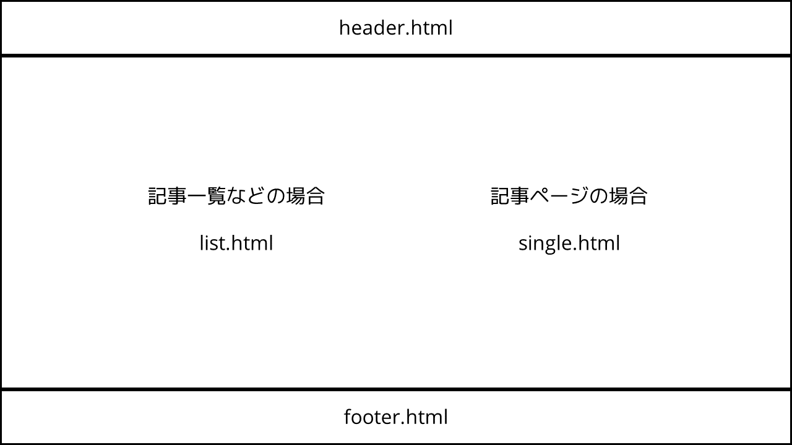
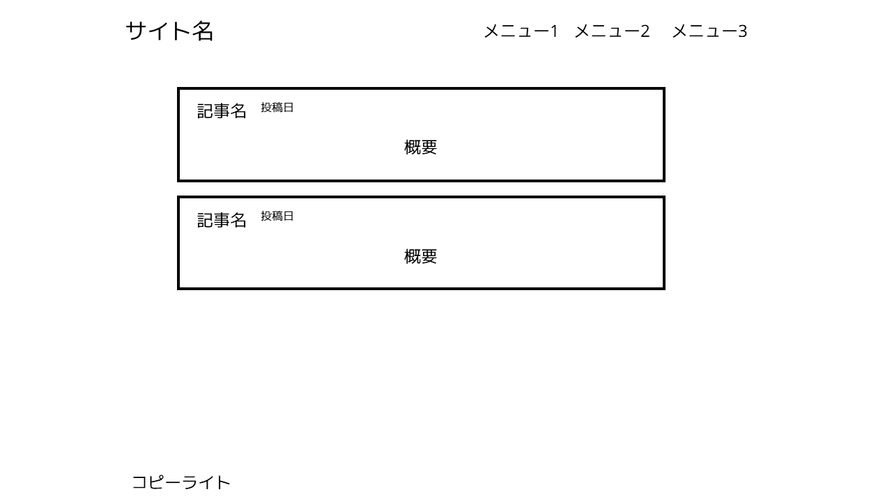
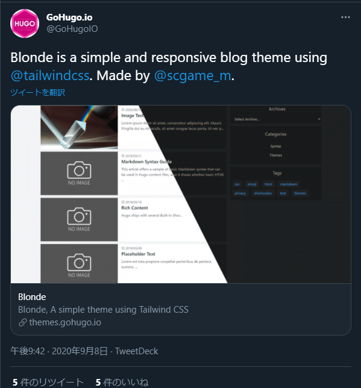

私がウェブサイトを作るときは、たいていHugoを使って作るのですが、そのたびに毎回適当な自作テーマを作っているので、備忘録として書き起こしておきます。

## テーマを作る

まずはHugoのサイト・テンプレートともに生成します。

```bash
hugo new site サイト名
hugo new theme テーマ名
```

### 方向性を決める

Hugoのテーマと言っても、ブログやドキュメント、ポートフォリオやECサイトまで、色々な方向性があります。ひとまず無難なブログ系のものにしておきます。

### 作る

レイアウトの考え方は下の図を参考にしてください。



このように作ると、だいたい下の図のようになります。



### ウィジェット

ウィジェットを作る際は、partialsにwidgetsフォルダを作成し、そこから呼び出すようにするとコードがすっきりして良いです。

## 機能

### Google Analytics

GoogleAnalyticsはHugo標準でサポートされていますが、いかんせんバージョンが古いので、自分で作った方がいいです。  
コードサンプルはこんな感じ。

```html
{{ if not .Site.IsServer }}
{{ with .Site.GoogleAnalytics }}
<!-- Global site tag (gtag.js) - Google Analytics -->
<script async src="https://www.googletagmanager.com/gtag/js?id={{ . }}"></script>
<script>
  window.dataLayer = window.dataLayer || [];
  function gtag(){dataLayer.push(arguments);}
  gtag('js', new Date());

  gtag('config', '{{ . }}');
</script>
{{ end }}
{{ end }}
```

これをhead.htmlに追加してしまえばいいですね。

### Disqus

Staticmanなどのコメント管理システムもありますが、残念ながらHugoでの導入解説がまるで見当たらないため、実装が簡単なDisqusを追加しましょう。  
以下のコードを挿入したい位置に追加すれば終わりです。

```html
{{ template "_internal/disqus.html" . }}
```

### Pagination

これがあるだけでいい感じに区切ることができます。  
正直どうやって実装したかすら忘れてしまいましたが、前作ったものがあったのでそのコードを載せておきます。

```html
{{ $pag := $.Paginator }}
{{ if gt $pag.TotalPages 1 }}
<nav aria-label="page navigation">
    <ul class="pagination">
        <!-- Don't show on 1st and 2nd page -->
        {{ if and (ne $pag.PageNumber 1) (ne $pag.PageNumber 2) }}
        <li class="page-item"><a href="{{ $pag.First.URL }}" rel="first" class="page-link duration-100 bg-white text-blue-600 hover:bg-gray-400 hover:text-blue-700">First</a></li>
        {{ end }}

        {{ if $pag.HasPrev  }}
        <li class="page-item"><a href="{{ $pag.Prev.URL }}" rel="prev" class="page-link duration-100 bg-white text-blue-600 hover:bg-gray-400 hover:text-blue-700">Prev</a></li>
        {{ end }}

        {{ range $pag.Pagers }}
            {{ if eq . $pag }} <!-- Current Page -->
            <li class="page-item active"><a href="{{ .URL }}" class="page-link duration-100 bg-blue-600 border-blue-600 text-white hover:bg-blue-700 hover:border-blue-700">{{ .PageNumber }}</a></li>
            {{ else if and (ge .PageNumber (sub $pag.PageNumber 2)) (le .PageNumber (add $pag.PageNumber 2)) }}
            {{ $.Scratch.Set "dot_rendered" false }} <!-- Render prev 2 page and next 2 pages -->
            <li class="page-item"><a href="{{ .URL }}" class="page-link duration-100 bg-white text-blue-600 hover:bg-gray-400 hover:text-blue-700">{{ .PageNumber }}</a></li>
            {{ else if eq ($.Scratch.Get "dot_rendered") false }} <!-- render skip pages -->
            {{ $.Scratch.Set "dot_rendered" true }}
            <li class="page-item disabled"><a class="page-link">...</a></li>
            {{ end }}
        {{ end }}

        {{ if $pag.HasNext }}
        <li class="page-item"><a href="{{ $pag.Next.URL }}" rel="next" class="page-link duration-100  bg-white text-blue-600 hover:bg-gray-400 hover:text-blue-700">Next</a></li>
        {{ end }}

        <!-- Don't show on last and 2nd last page -->
        {{ if and (ne $pag.PageNumber $pag.TotalPages) ((ne $pag.PageNumber (sub $pag.TotalPages 1))) }}
        <li class="page-item"><a href="{{ $pag.Last.URL }}" rel="last" class="page-link duration-100 bg-white text-blue-600 hover:bg-gray-400 hover:text-blue-700">Last</a></li>
        {{ end }}
    </ul>
</nav>
{{ end }}
```

### そのほか

例えば、タグやアーカイブ（年/月）、ダークモードのサポートやレスポンシブ対応などいろいろ追加できます。（しようと思えば）

## 公開

### デモ

自分でデモサイトを用意しておくのがおすすめです。  
たまに開発環境と運用環境で違いがあったりするので、そういう時に確認することができます。  
運用はNetlifyかGithub Pages、最近ではCloudflare Pagesなどを使うのもよいと思います。

### Pull Request

※2021年6月の終わりにテーマ公開の手順が変更されました。

Hugoの公式テーマとして公開するためには、hugoThemesSiteBuilderのリポジトリにPull Requestする必要があります。  
チェック項目は以下の通り

- README.mdがある
- LICENSE.mdがある
- theme.tomlのすべての項目を記入してある
- テーマのimagesフォルダにtn.png(900×600)とscreenshot.png(1500×1000)のスクリーンショットが置いてある
- themes.txtに正しいGithub（またはGitLabなど）のURLが追加されている

これらをすべて満たしたら、Pull Requestを送りましょう。  
作成時にNetlifyでプレビューが生成されるので、それで表示の確認をしておきましょう。

### 承認

無事承認されたら、公式Twitterとテーマサイトで公開されます。



## 終わりに

テーマの自作に慣れてしまえばドキュメントとか何も見ずに簡単にテーマを作れるようになるので、どんどん作っていきましょう。
