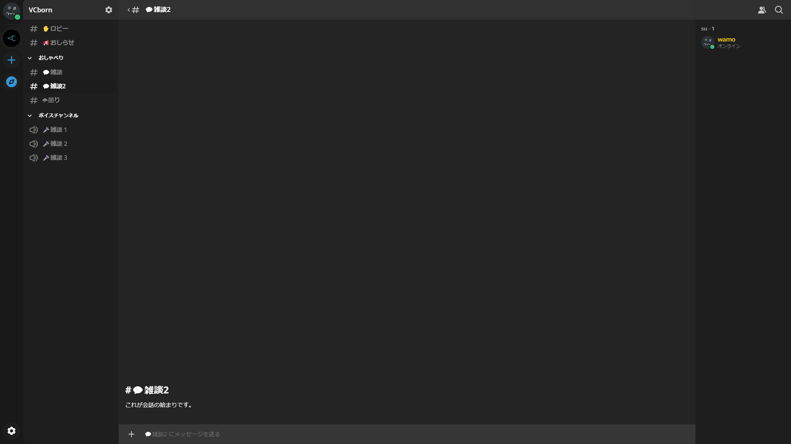
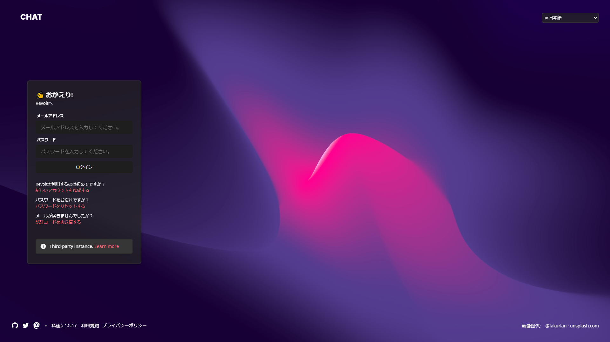

Mattermostやrocket.chatなどセルフホストできるSlackのようなものは結構ありますが、セルフホストできるDiscordとなるとそう多くはありません（というか見つけられたのがこれ一つ）。

Revoltはセルフホストもできるらしいのでやってみました。

## Revoltとは

<figure>



<figcaption>

こんな感じ

</figcaption>

</figure>

AGPL-3.0で提供されているDiscordクローンです。

オープンソースとプライバシー保護を売りにしているらしい。

UIはほとんどDiscordで、音声通話機能もあります。日本語化もされています。

## Revoltを立てる

公式の手順ではDockerを使用する方法しか書かれていないので、Dockerを使用していきます。

まずは手順通りコマンドを実行します。

```bash
git clone https://github.com/revoltchat/self-hosted revolt
cd revolt
cp .env.example .env
```

### 環境変数

.env内を以下のようにします。\[\]内は各自埋めてください。

ドメインについては、今回は各サービスごとにサブドメインを作ることにします。

※Cloudflareではサブサブドメインが使えないので、サブドメインで作成しました。

```
##
## Quark configuration
##
# MongoDB
MONGODB=mongodb://database
# Redis
REDIS_URI=redis://redis/
# URL to where the Revolt app is publicly accessible
REVOLT_APP_URL=https://[Revoltのドメイン]
# URL to where the API is publicly accessible
REVOLT_PUBLIC_URL=https://[APIのドメイン]
VITE_API_URL=https://[APIのドメイン]
# URL to where the WebSocket server is publicly accessible
REVOLT_EXTERNAL_WS_URL=wss://[WebSocketのドメイン]
# URL to where Autumn is publicly available
AUTUMN_PUBLIC_URL=https://[Autumnのドメイン]
# URL to where January is publicly available
JANUARY_PUBLIC_URL=https://[Januaryのドメイン]
# URL to where Vortex is publicly available
VOSO_PUBLIC_URL=https://[Vortexのドメイン]
##
## hCaptcha Settings
##
# If you are sure that you don't want to use hCaptcha, set to 1.
REVOLT_UNSAFE_NO_CAPTCHA=0
# hCaptcha API key
REVOLT_HCAPTCHA_KEY=[hCaptchaのシークレットキー]
# hCaptcha site key
REVOLT_HCAPTCHA_SITEKEY=[hCaptchaのサイトキー]
##
## Email Settings
##
# If you are sure that you don't want to use email verification, set to 1.
REVOLT_UNSAFE_NO_EMAIL=0
# SMTP host
REVOLT_SMTP_HOST=[SMTPサーバー]
# SMTP username
REVOLT_SMTP_USERNAME=[SMTPユーザー名]
# SMTP password
REVOLT_SMTP_PASSWORD=[SMTPパスワード]
# SMTP From header
REVOLT_SMTP_FROM=[送信者] <[送信元メールアドレス]>
##
## Application Settings
##
# Whether to only allow users to sign up if they have an invite code
REVOLT_INVITE_ONLY=0
# Maximum number of people that can be in a group chat
REVOLT_MAX_GROUP_SIZE=150
# VAPID keys for push notifications
# Generate using this guide: https://gitlab.insrt.uk/revolt/delta/-/wikis/vapid
# --> Please replace these keys before going into production! <--
REVOLT_VAPID_PRIVATE_KEY=[後述]
REVOLT_VAPID_PUBLIC_KEY=[後述]
##
## Autumn configuration
##
# S3 Region
AUTUMN_S3_REGION=minio
# S3 Endpoint
AUTUMN_S3_ENDPOINT=http://minio:9000
# MinIO Root User
MINIO_ROOT_USER=minioautumn
# MinIO Root Password
MINIO_ROOT_PASSWORD=minioautumn
# AWS Access Key ID
AWS_ACCESS_KEY_ID=minioautumn
# AWS Secret Key
AWS_SECRET_ACCESS_KEY=minioautumn
##
## Vortex configuration
##
VOSO_MANAGE_TOKEN=[ランダムな文字列]
VOSO_WS_HOST=wss://[Vortexのドメイン]
MANAGE_TOKEN=[ランダムな文字列]
WS_URL=wss://[Vortexのドメイン]
RTC_IPS=0.0.0.0,127.0.0.1,[公開IP]
RTC_MIN_PORT=10001
RTC_MAX_PORT=10100
```

VAPIDは別途生成する必要があるそうです。

以下のコマンドで生成してみます。

```bash
openssl ecparam -name prime256v1 -genkey -noout -out vapid_private.pem
base64 vapid_private.pem
openssl ec -in vapid_private.pem -outform DER|tail -c 65|base64|tr '/+' '_-'|tr -d '\n'
```

2行目を実行して出力されたものを`REVOLT_VAPID_PRIVATE_KEY`に、3行目を実行して出力されたものを`REVOLT_VAPID_PUBLIC_KEY`に入れます。

### docker-compose.yml

音声通話を使うためには、docker-composeにvortexを追加する必要があります。

そこで以下のコードを`docker-compose.yml`の下部に追加します。

```yaml
  vortex:
    image: ghcr.io/revoltchat/vortex:0.3.0-alpha.1
    env_file: .env
    ports:
      - "8080:8080"
      - "$RTC_MIN_PORT-$RTC_MAX_PORT:$RTC_MIN_PORT-$RTC_MAX_PORT/tcp"
      - "$RTC_MIN_PORT-$RTC_MAX_PORT:$RTC_MIN_PORT-$RTC_MAX_PORT/udp"
    restart: always
```

### nginxの設定

この記事ではリバースプロキシとしてnginxを使用します。

`/etc/nginx/sites-available`に新しくファイルを作成し、以下のように設定します。

```nginx
map $http_host $revolt_upstream {
  [Revoltのドメイン] http://127.0.0.1:5000;
  [APIのドメイン] http://127.0.0.1:8000;
  [WebSocketのドメイン] http://127.0.0.1:9000;
  [Autumnのドメイン] http://127.0.0.1:3000;
  [Januaryのドメイン] http://127.0.0.1:7000;
  [Vortexのドメイン] http://127.0.0.1:8080;
}
server {
        listen 443 ssl;
        server_name [Revoltのドメイン] [APIのドメイン] [WebSocketのドメイン] [Autumnのドメイン] [Januaryのドメイン] [Vortexのドメイン];
        add_header Strict-Transport-Security 'max-age=31536000;' always;
        ssl_certificate [証明書のパス];
        ssl_certificate_key [秘密鍵のパス];
        ssl_ciphers 'HIGH !aNULL !eNULL !kECDH !DSS !MD5 !EXP !PSK !SRP !CAMELLIA !SEED !RSA';
        ssl_prefer_server_ciphers on;
        ssl_protocols TLSv1.2 TLSv1.3;
        ssl_session_cache shared:SSL:1m;
        ssl_session_timeout 5m;
        if ($http_upgrade) {
                # Here, the path is used to reverse the generation of ws. Just roll the keyboard to prevent conflicts with other services.
                rewrite ^(.*)$ /ws_78dd759593f041bc970fd7eef8b0c4af$1;
        }
        location / {
             proxy_pass $revolt_upstream;
             proxy_set_header Host $host;
        }
        location /ws_78dd759593f041bc970fd7eef8b0c4af/ {
                # Note that here is the trailing slash.
                proxy_pass $revolt_upstream/;
                proxy_http_version 1.1;
                proxy_set_header Host $host;
                proxy_set_header Connection $http_connection;
                proxy_set_header Upgrade $http_upgrade;
                # Important, to prevent ws from sending data for a long time and causing timeout disconnection.
                proxy_read_timeout 24h;
        }
}
```

### 起動

```bash
docker-compose up -d
```

`docker ps`などで確認し、問題なく起動できていればOKです。

<figure>



<figcaption>

ログイン

</figcaption>

</figure>

## 最後に

Revoltのセルフホストはドキュメントが少なく、self-hostedリポジトリのIssueやvortexのIssueなどを参考にしてどうにか稼働させることができました。

Revoltはまだ開発途中でバグが多く、欲しい機能も微妙に実装されていなかったりするので、今後に期待です。
