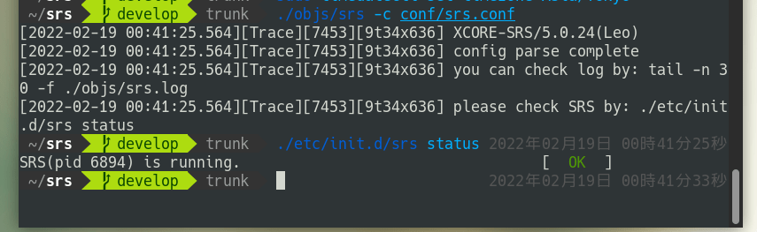
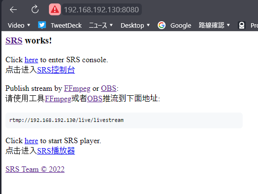
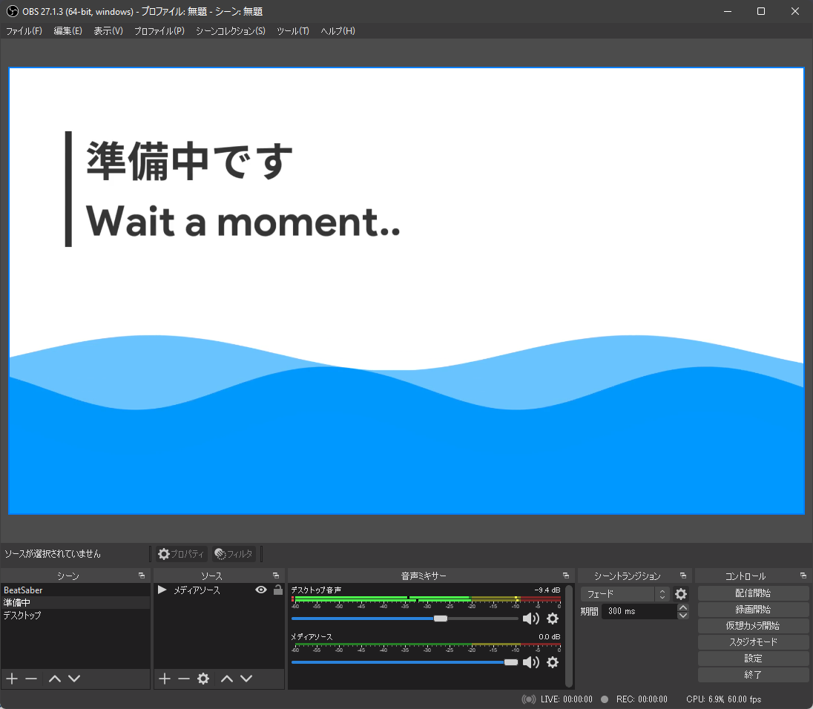
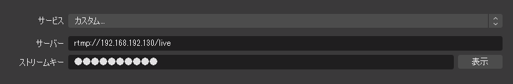
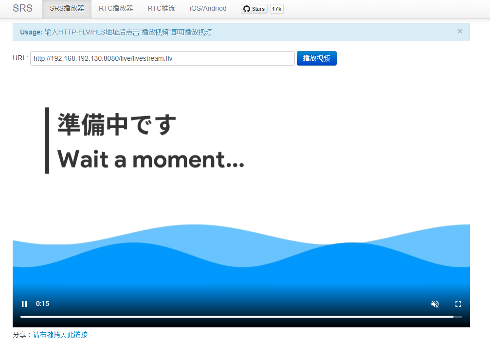
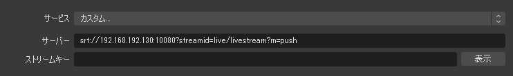

以前ライブ配信システムについて調べていた時に、SRSなるものがあることを知りました。

今回はこれを使用して自前でライブ配信サーバーを立ててみようと思います。

## SRSとはなんぞや

[https://github.com/ossrs/srs](https://github.com/ossrs/srs)

現在主流の映像伝送プロトコルはRTMP（Real-Time Messaging Protocol）ですが、その後釜としてSRT（Secure Reliable Protocol）があります。

これに特化したサーバー...というわけではなく、RTMPやSRT、HLS（HTTP Live Streaming）などなんでもござれなライブ配信サーバーソフトウェアです。

IssueやWikiなどを見るに中国の方が開発されているのだと思います。

## 実際に立てる

この記事ではVMWare Player上にCentOS 7の仮想環境を立ててやっていきます。

まずはリポジトリをclone。

```bash
git clone -b develop https://gitee.com/ossrs/srs.git
```

そして`srs/trunk`内でビルド。

```bash
cd srs/trunk
./configure
make
```

後はコンフィグを指定して起動。

```bash
./objs/srs -c conf/srs.conf
```

これでSRSを起動することができました。



そうしたら、ファイアウォールで以下のポートを開放します。

- 8080/tcp（ウェブ管理画面）

- 1935/tcp（RTMPを使用する場合）

- 1985/tcp（HTTP API）

- 10080/udp（SRTを使用する場合）

`http://IPアドレス:8080`でブラウザからも確認できるようになりました。



## RTMPで配信してみる

普段使用している配信用準備中の画面を配信してみます。



まず設定に書いてあったアドレスに設定。（ストリームキーは`livestream`にセット）



配信開始しウェブからプレビューしてみると、確かに表示できていますね。



## SRTで配信してみる

SRTを使用できるようにするため、SRSを再度ビルドします。

```bash
./configure --srt=on && make
```

次に使用するコンフィグをSRT用のものに変更します。

```bash
./objs/srs -c conf/srt.conf
```

OBS側の設定は、ストリームキーを空にし、サーバーを以下のように設定します。



これでいけるらしい...のですが残念ながら手元の環境では動きませんでした。

原因が分かればまた試してみようと思います。

## 最後に

SRSを使って簡単に自前でライブ配信サーバーを用意することができました。

これとPlyrなどを組み合わせて独自配信プラットフォームとかを作ると楽しそうですね。
