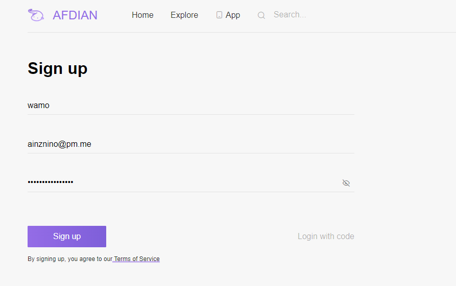
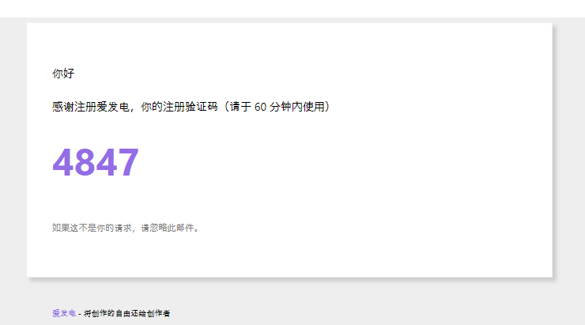
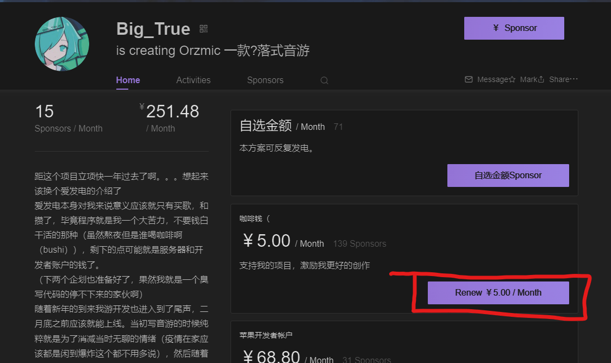
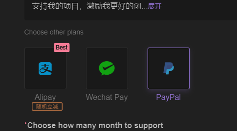
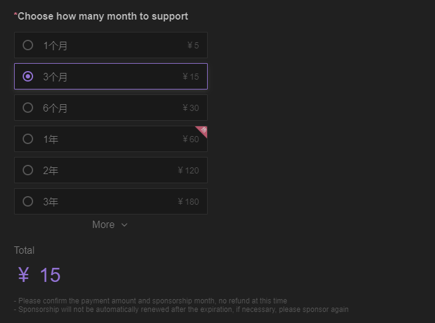
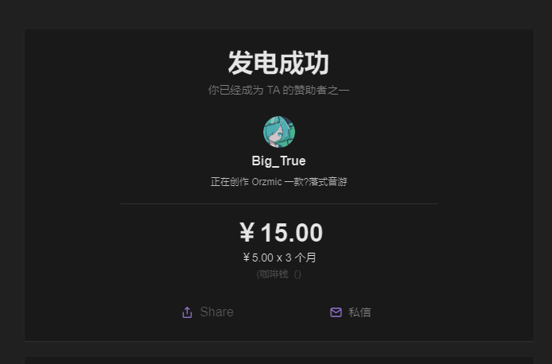

一般的な寄付プラットフォームには、日本ならOFUSE、世界ではPatreonやko-fiなどがあります。

中国では爱发电（Afdian）というサービスがあり、それを使っているクリエイターもよく見かけます。

そこで、今回は爱发电から寄付をしてみます。

※寄付には**爱发电アカウント**と**PayPalアカウント**が必要です。

## アカウント登録

https://afdian.com/reg

Nameにはユーザー名、Emailにはメールアドレス、Passwordにはパスワードを入れましょう。

すると、メールアドレス宛に認証コードが送られてくるので、それを入力します。

## 寄付

実際に寄付をしてみましょう。

支援したいクリエイターのページを開き、支援するプランを選択します。

決済方法が現れますが、AlipayやWechat Payはパスポートがないと登録できないため、PayPalで寄付をします。

次に、何か月分を購入するかを選択します。

最後に、何か送りたいメッセージがあれば**Leave a message**の欄に記入し、**Pay**で決済します。

PayPalのウィンドウがポップアップで開くので、クレカなどを選択して完了します。

※PayPal決済では、実際に寄付する金額 + 手数料4.4% + 0.3 USドルが引き落とされます。

### 余談

以前はPayPal決済は部分的なサポートでした。爱发电運営のPayPalアカウントに対して送金し、自分のアカウントで運営にログインしてもらって支援という面倒な手順を踏む必要がありました。

いつからかはわかりませんが、PayPalも完全にサポートされるようになりましたし、サイトも英語に対応しました。うれしいニュースです。

## 完了

決済がうまくいけば、このように成功の画面になります。

なお、爱发电には**自動更新の機能はありません**。更新日になったら、サイトから手動で支払いを行いましょう。
