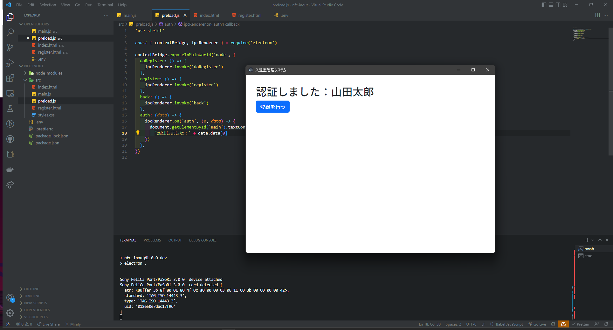

私の所属している部活の入退室管理システムが欲しくなりました。

そこでどのように認証させるか悩んだのですが、FeliCaのようなカードで触れるだけであれば簡単だしカッコいいのでそれで作ることにします。

## 使うもの

FeliCa Lite-Sの無地カードはAmazonで購入しました。

この記事ではFeliCaの認証機能を使用していないため、安価なNTAG215カードでも可能です。

- FeliCa Lite-S 無地カード
- PaSoRi（RC-S380）
- Node.js
- mysql（mariadb）

本来はTypeScriptで書く予定でしたが、`nfc-pcsc`が対応していないためJavaScriptになりました。

## ライブラリ

- nfc-pcsc（NFC読み書き）
- axios（Discordへの通知送信）
- ulid（ID生成）
- sound-play（効果音の再生）
- electron（アプリ化）
- electron-builder（アプリのビルド）
- @electron/rebuild（nfc-pcscliteの再ビルド）
- mysql2（データベースへの接続）

## RWテスト

データの読み書きができるか確認していきます。

まずは適当なNode.jsプロジェクトを作成し、`nfc-pcsc`とその他諸々インストールします。

```shell
npm init -y
npm i nfc-pcsc axios dotenv mysql2 ulid sound-play
npm i -D electron @electron/rebuild electron-builde
```

公式のExampleはそのままでは使えないので、少し改変して使えるようにします。

前提として、FeliCa Lite-Sはユーザーが書き込みできるブロック（1ブロック＝16バイト）が14個存在します。

`reader.read`の初期ブロックサイズは4なので16を指定してあげます。

```js
const { NFC } = require('nfc-pcsc');
const nfc = new NFC();
reader.on('card', async card => {
	console.log();
	console.log(`card detected`, card);
	try {
		const data = await reader.read(0, 16, 16); // ブロックサイズ16のブロック0から16バイトを読み出し
		console.log(`data read`, data);
		// もし文字列が16バイト未満の場合\x00が出力されてしまうので消す
		const payload = data.toString().replace(/\0/g, '');
		console.log(`data converted`, payload);
	} catch (err) {
		console.error(`error when reading data`, err);
	}
	try {
		// 16バイトのバイト列に文字列を格納
		const data = Buffer.allocUnsafe(16);
		data.fill(0);
		const text = (new Date()).toTimeString();
		data.write(text);
		// ブロックサイズ16のブロック0にデータを書き込み
		await reader.write(0, data, 16);
		console.log(`data written`);
	} catch (err) {
		console.error(`error when writing data`, err);
	}
});
```

これで、正常にデータの読み書きができるようになりました。

## データベース

### データ構造

プライマリキーとなるid、名前、入退室状態、IDm（カード固有のID）の4つのデータがあればやりたいことができます。

プライマリキーはランダムな方がいいのでULIDで生成します。

### 実装

入退室の状態を管理するためにデータベースを使用します。

また、後でほかのプログラムからも参照できるように、sqliteやjsonなどのローカルデータベースではなくmysqlを使用します。

データ編集の度にクエリを書くのは非常に面倒なので一つの関数で大体できるようにしました。

```js
const mysql = require('mysql2/promise')
/*
データベースの操作
type: register, update, read, delete
data: {id, name, state}
*/
async function controlDB(type, data) {
  const connection = await mysql.createConnection(process.env.DATABASE_URL)
  if (type === 'register') {
    const res = await connection.query(
      'INSERT INTO users (id, name, state, idm) VALUES (?, ?, ?, ?)',
      [data.id, data.name, data.state, data.idm]
    )
    connection.end()
    return res.affectedRows == 1
  } else if (type === 'update') {
    const res = await connection.query(
      'UPDATE users SET state = ? WHERE id = ? AND idm = ?',
      [data.state, data.id, data.idm]
    )
    connection.end()
    return res.affectedRows == 1
  } else if (type === 'delete') {
    const res = await connection.query(
      'DELETE FROM users WHERE id = ? AND idm = ?',
      [data.id, data.idm]
    )
    connection.end()
    return res.affectedRows == 1
  } else {
    const rows = await connection.query(`SELECT * FROM users WHERE idm = ?`, [
      data.idm,
    ])
    connection.end()
    return rows[0]
  }
}
```

## 暗号化

カードには認証した人の名前とそのIDを格納するのですが、そのまま格納しただけではだれでも名前を見ることができてしまいます。

そこで、AES-256-CBCで書き込み時にデータを暗号化することにします。

### データ構造

AES-256-CBCで16バイト以下のデータを暗号化すると、出力はbase64の場合24バイトの文字列になります。

つまり、データnバイトでは出力が`24 + 20 * (Math.ceil(n / 16) - 1)`バイトになります。

大抵の人の名前は漢字で4文字か5文字なのでその場合は問題ないのですが、名前がカタカナの場合は文字数が多くなりがちなので、16バイトを超える可能性があります。

念のため名前用に4ブロックを確保し、最大48バイトまで入力できるようにします。

### 実装

まず暗号化用の関数を作成します。

暗号化には暗号鍵とサルトとベクトルが必要なので、それらは.envで管理します。

ベクトルは本来保存するデータごとに変えるのが良いのですが、それは面倒なので暗号鍵を元に生成することにします。

```js
const crypto = require('crypto')
require('dotenv').config({ path: __dirname + '/../.env' })
const key = crypto.scryptSync(process.env.CRYPT_KEY, process.env.CRYPT_SALT, 32)
// ベクトルの生成
const iv = Buffer.alloc(16)
iv.write(process.env.CRYPT_KEY)
// 暗号化
function encrypt(text) {
  const encryptalgo = crypto.createCipheriv('aes-256-cbc', key, iv)
  let encrypted = encryptalgo.update(text, 'utf8', 'base64')
  encrypted += encryptalgo.final('base64')
  return encrypted
}
// 復号化
function decrypt(encrypted) {
  const decryptalgo = crypto.createDecipheriv('aes-256-cbc', key, iv)
  let decrypted = decryptalgo.update(encrypted, 'base64', 'utf-8')
  decrypted += decryptalgo.final('utf-8')
  return decrypted
}
```

## Discordの通知

axiosとwebhookを使って簡単に作ります。

```js
const post = await axios.post(
  process.env.DISCORD_WEBHOOK, {
    username: '入退室管理',
    content: `???? ${res.data[0]}さんが${
                  res.db[0].state === 0 ? '入室' : '退室'
                }しました`,
  }, {
    headers: {
      Accept: 'application/json',
      'Content-type': 'application/json',
    },
  }
)
```

## 組み合わせ

これまでに作成した関数をうまいこと組み合わせて読み書きをします。

https://github.com/opera7133/nfc-inout/blob/main/src/main.js

## デザイン



Bootstrap 5を使いました。フォントはいつものNoto Sans JP。

## 完成

<video width="1920" height="1080" controls>
  <source src="/videos/2023-01-14-00-29-11.mp4" type="video/mp4">
</video>

## 問題点

### 書き込み制限なし

真面目な認証機能を作成するのであれば、カードに書き込み制限を付けるべきなのですが、これは真面目じゃないので入れていません。

### コードが見づらい

勢いのまま作成したため一つのファイルにすべてのコードが入っていて見づらいです。

### SuicaやPASMOでも登録したい

どのカードでも認証できるようになれば楽。

### FeliCa Lite-Sが高い

別にFeliCaである必要はないので、NTAG215カードに置き換えることを検討しています。

NTAG215カードは[データシート](https://www.nxp.com/docs/en/data-sheet/NTAG213_215_216.pdf)によるとブロックではなくページという単位で管理されており、1ページは4バイトだそうです。

FeliCaとNTAG215を判別する機能を作れればよさそう。

## 終わりに

今回制作したアプリはGitHubに公開しています。

https://github.com/opera7133/nfc-inout
