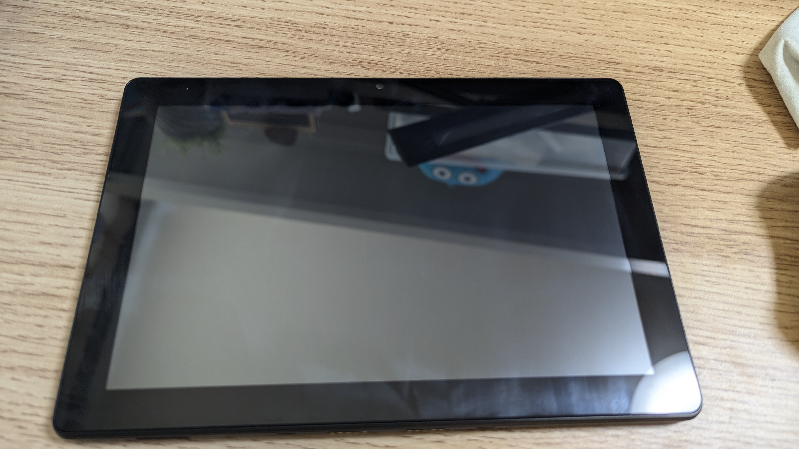
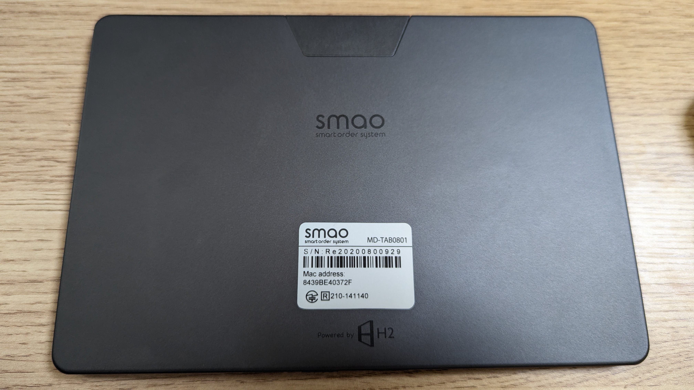
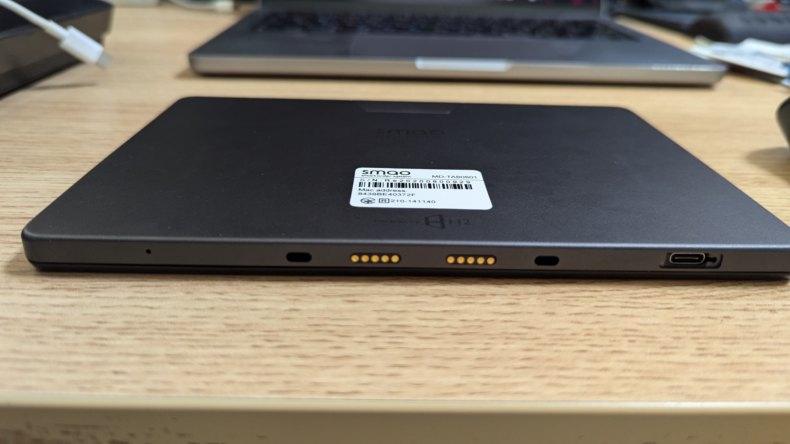
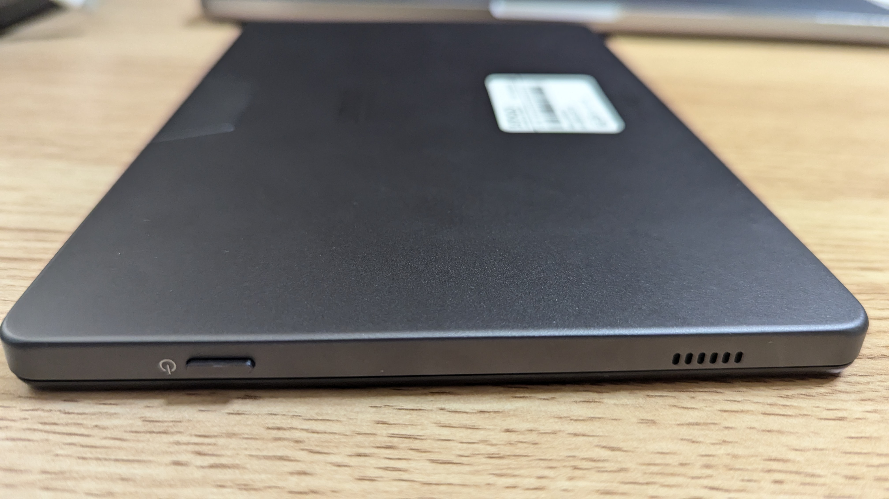
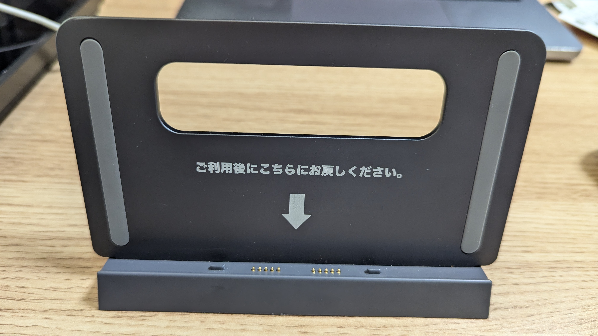
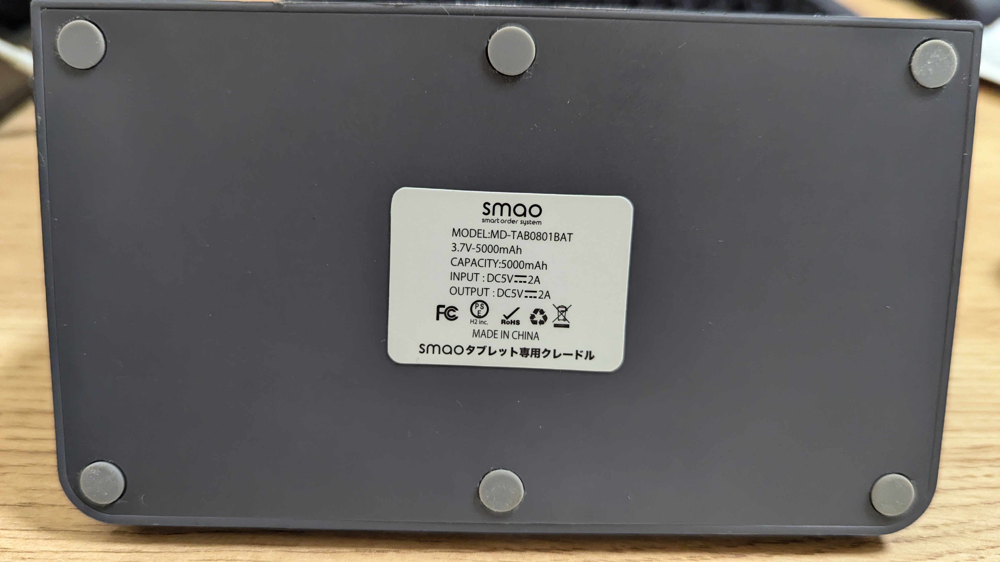

友人からsmaoのMD-TAB0801を1000円程度で購入しました。

## これは何

株式会社H2が運営していたsmaoというオーダーシステム用のタブレットです。

smaoのウェブサイトは2023年頃までは存在していたようですが、ドメインの失効によりなくなっています。

2022年時点のH2Technologyのサイトにも記載がないため、その時点ではサービス終了していたと思われます。

※1 株式会社H2Technologyはsmaoのリリースから数カ月後に株式会社H2から分社化、その後株式会社H2は2024年に株式会社アプリックスに買収されています。  
※2 株式会社H2（旧：株式会社PRESiDE）は2017年に総務省より行政指導を受けています。

## スペック

- SoC: Helio P22
- メモリ: 2GB LPDDR3
- ストレージ: 16GB
- ディスプレイ: 8インチ 1280x800 56.1Hz
- バッテリー: 3800mAh + 5000mAh(クレードル)
- Android: 9 (Pie)
- カメラ: 1600x1200 (2.0MP)

SIMが2枚（SIM1枚 + microSD可）刺さります。

ステレオミニジャック、音量ボタン（！）、リアカメラ、GMS等ありません。

Wi-FiとBluetoothは使えます。Wi-Fiは5GHz拾うらしい。

もちろんWidevineはL3。

## 外観

### 本体

表面

裏面

上部

下部

右側

裏面はメタリックで見た目はかっこいいと思います。

### クレードル

表

裏

下

## センサー

一応加速度センサーは入っているようです。

光センサーはカメラ...ではなく端末右側にあります。

ジャイロやバロメーターなどはありません。

## 謎のUI

ステータスバーが引き出せません。また、ナビゲーションバーは固定できません。

設定にはジェスチャーやAndroidバージョンの項目がありません。

Bluetoothやキャストの項目には直接アクセスできないようになっています。（検索からアクセスできます）

## できること

GMSは通常のFireタブレットのようにインストールしても使用できません。

[Aurora Store](https://f-droid.org/en/packages/com.aurora.store/)を入れるなりしてアプリを入れましょう。

YouTube (ReVanced)やNova Launcher、Spotifyなどのアプリは普通に動きます。

開発者オプションが使用できるので、adbで多少いじることもできます。

ステータスバーを引き出せないため、[Gesture Control](https://play.google.com/store/apps/details?id=com.conena.navigation.gesture.control)を入れ、上・下スワイプを通知、右スワイプを戻るに設定すると便利です。
