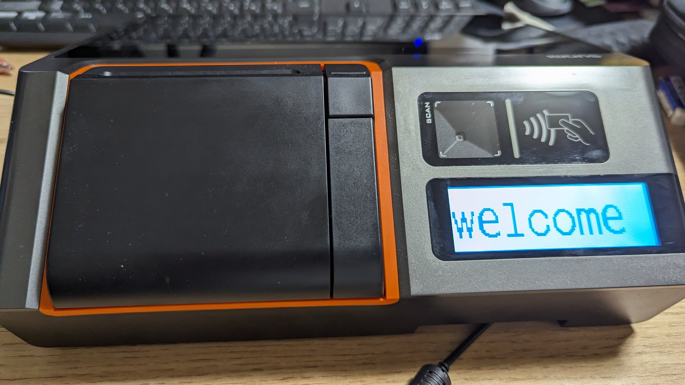

ヤフオクでSUNMI T2 MINIを購入しました。

## 概要



レシートプリンターとLCDディスプレイとNFCタッチとQRコードリーダーのついたAndroidタブレットです。

スペックは以下のページ参照。

https://www.e-welcom.com/products/h/other/sunmi-t2-mini/

私の買ったモデルは80mmレシートプリンターのついたモデルでした。

ちなみにSUNMI M2 MINIもついてました。

https://www.e-welcom.com/products/h/terminal/sunmi-m2/

## T2-MINIのGMSの有効化

Google Playを入れていきます。

1. 設定 > バックアップとリセット > データの初期化 > タブレットをリセットから本体を初期化
2. 「ようこそ」の画面でWi-Fiの設定まで進める
3. 左下の「タイムスリップ体験」を押す
4. 設定 > About DeviceのOS versionを数回クリックし、開発者オプションを有効化
5. USBデバッグを有効化
6. 本体底面のUSB Micro-BをPCにつなぎ、adbで接続（この時点では認証をスキップして接続可能）
7. adbで適当なファイルマネージャーのapkをインストール
8. Google Play開発者サービス・Google Play Store・Google Mapsの3つのapkを`/sdcard/Download`に転送
9. ファイルマネージャーから3つのapkをインストール
10. 以下のコマンドを実行する
```
adb shell pm enable com.google.android.gms
adb shell pm enable com.android.vending
adb shell pm enable com.google.android.apps.maps
adb shell pm disable-user --user 0 com.sunmi.baseservice
```
11. 右側のタイマーからアクティブを選択、そのまま進める
12. 完了！

この手順を完了すると、再起動してもGMSやPlay Storeは無効になりません。

ただし、adbは接続できなくなります。（ケーブルを指しても許可ダイアログが出ない）

## M2のGMS有効化

こちらはシンプルで、設定から提供元不明のアプリを有効化し、ブラウザなどでダウンロードしたGMSとPlay Storeのapkをインストールするだけです。

特にその他の設定は必要ありません。
